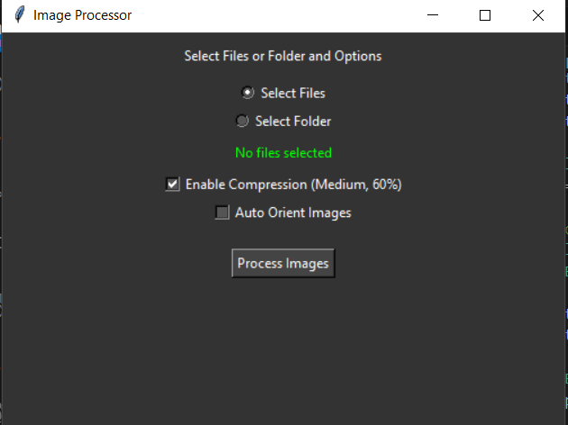

# Batch Photo Compressor

## Features
- Batch compress images to reduce file size.
- Select individual files or entire folders for processing.
- Option to auto-orient images based on EXIF data.

## Usage
1. Run the `main.py` script.
2. Select whether you want to process individual files or an entire folder.
3. Choose the files or folder you want to compress.
4. Optionally, enable the "Auto Orient Images" checkbox to automatically rotate images based on their EXIF orientation data.
5. Click "Process Images" to start the compression and orientation process.
6. The processed images will be saved in a new folder with a timestamp in the selected output directory.



## Requirements
- Python 3.x
- Pillow library
- Tkinter library

## Installation
Install the required libraries using pip:
```
pip install pillow
```

